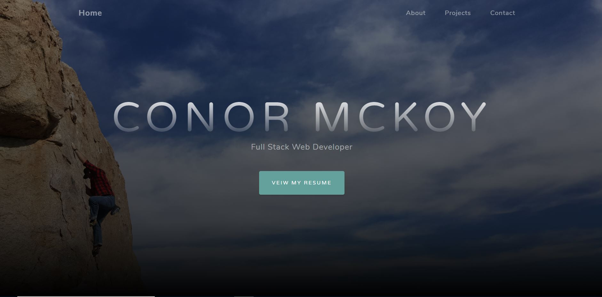

# Professional Page

## Table of Contents
 * [Description of App](#description)
 * [Technologies Used](#technology)
 * [Demo of App](#demo)
 * [License](#license)
 * [Contact Info](#contact-info)
 * [Live Site](https://mckoyc94.github.io/Professional_Page/)

## Description 
Utilizing a Bootstrap Template, I created a single page profile website to show off my projects and link people to my resume.

## Technology
* HTML
* CSS
* Javascript
* Bootstrap 
* [Bootstrap Templates](https://startbootstrap.com/themes/grayscale/)

## Demo

Prospective employers are first greeted with a title page with the option to download my resume if they so choose.

They may then scroll down through the page to view my information, browse my projects, or find my contact information. If they wish to further check out my projects, they can click on the links to check them out. 

## License
    MIT License

## Contact info
<b> Email: </b> cmckoy@elon.edu

If you'd like to view the app yourself, please visit https://mckoyc94.github.io/Professional_Page/

